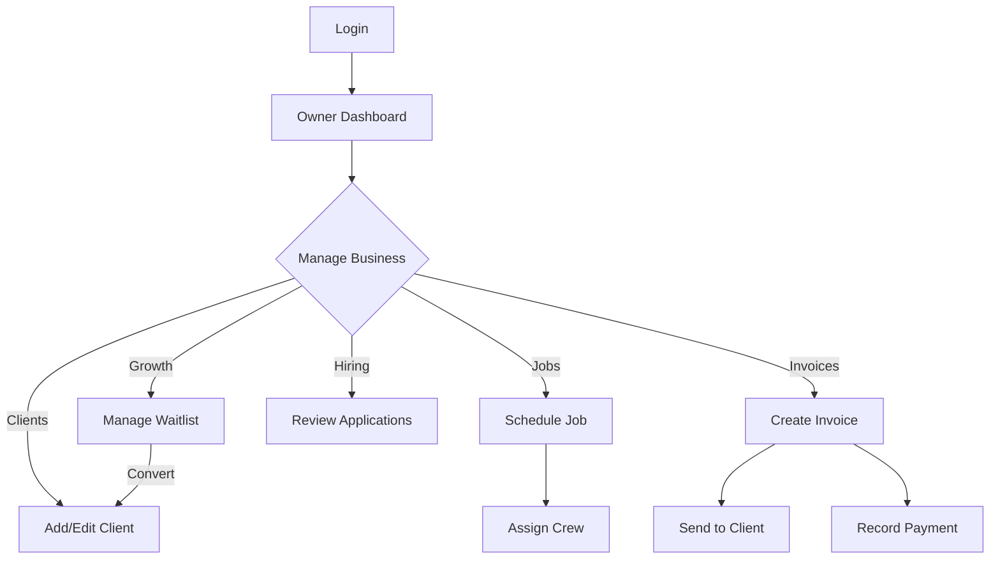
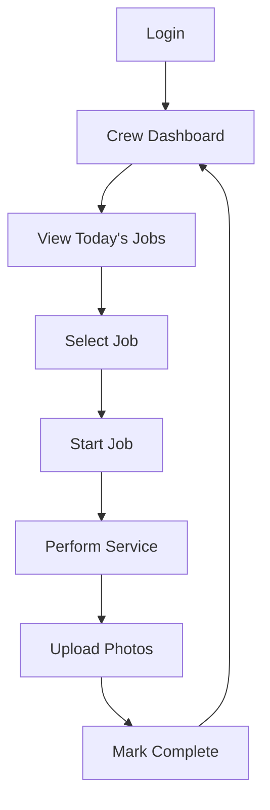
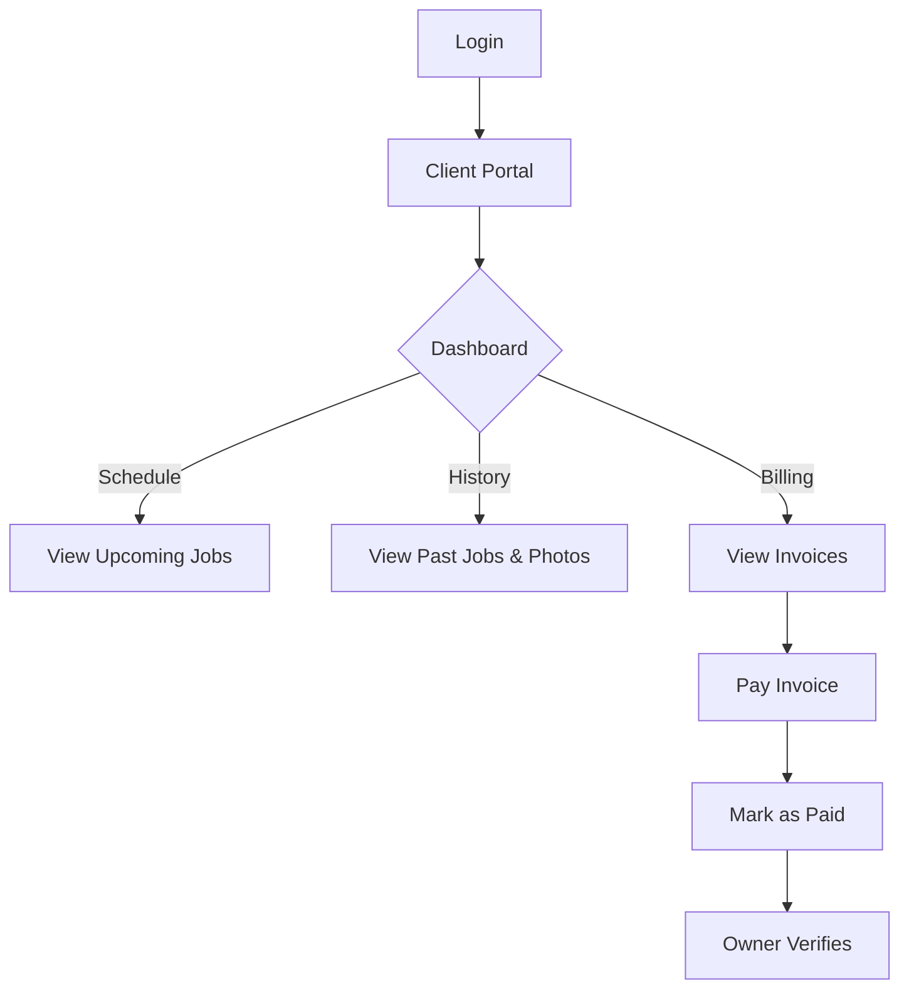

# Xcellent1 Lawn Care - User Flows

This document outlines the primary user journeys for the three main roles in the
system: **Owner**, **Crew**, and **Clients**.

## 1. Owner Workflow (LaCardio)

The Owner dashboard is the command center for the business. It allows for
managing clients, scheduling jobs, invoicing, and tracking business performance.

### 🏢 Core Owner Journey

1. **Login**: Access the system via `/login.html` or the specific Setup Link.
2. **Dashboard Overview**: View high-level metrics (Active Clients, Jobs this
   Week, Revenue).
3. **Client Management**:
   - Navigate to **Clients**.
   - Add new clients with address and service preferences.
   - Edit existing client details as needed.
4. **Job Scheduling**:
   - Navigate to **Jobs**.
   - Create a single or recurring job.
   - Assign a Crew Member (or self).
   - Set date and time.
5. **Invoicing & Payments**:
   - Navigate to **Invoices**.
   - Create invoices for completed jobs (can be done in bulk or individually).
   - **Record Payment**: When a client pays via Cash, Check, CashApp, etc.,
     manually record it against the invoice.
   - Verify "Pending" external payments if clients marked them as paid.
6. **Hiring & Waitlist**:
   - Review **Applications** from the careers page.
   - Convert leads from the **Waitlist** into active Clients.

### 📐 Owner Flow Diagram

---

## 2. Crew Workflow

Crew members use a mobile-friendly interface to manage their daily work,
navigate to sites, and document their service.

### 🚜 Crew Daily Journey

1. **Login**: Access via mobile device at `/login.html`.
2. **View Schedule**:
   - On the **Crew Dashboard** (`/crew.html`), view the list of jobs assigned
     for "Today".
   - See address, service type (Mowing, Edging, etc.), and specific notes.
3. **Start Job**:
   - Click **"Start Job"** (status updates to In Progress).
   - Use "Get Directions" to open maps.
4. **Document Work**:
   - **Upload Photos**: Take "Before" and "After" photos directly from the
     phone.
   - Add notes if there were issues (e.g., "Gate locked", "Sprinkler damaged").
5. **Complete Job**:
   - Click **"Mark Complete"**.
   - Job moves to "Completed" history.

### 📐 Crew Flow Diagram

---

## 3. Client Workflow

Clients have a self-service portal to view their schedule, history, and pay
invoices.

### 🏡 Client Experience

1. **Login**: Access via `/login.html` (or magic link in email).
2. **View Dashboard**:
   - See **Upcoming Jobs**: When to expect the crew next.
   - See **Balance Due**: Total outstanding amount.
3. **Service History**:
   - View past jobs.
   - See proof-of-work "After" photos uploaded by the crew.
4. **Invoicing & Payment**:
   - Navigate to **Invoices**.
   - View details of open invoices.
   - **Pay Online**:
     - Choose payment method (CashApp, PayPal, etc.).
     - Follow instructions to pay externally.
     - Click **"I Have Paid"** to notify the owner.
   - View receipt/history of paid invoices.

### 📐 Client Flow Diagram

---

## 🔗 Deep Links

- **Owner Login**: `/login.html`
- **Owner Setup**: `/owner-setup.html?token=...`
- **Crew Dashboard**: `/crew.html`
- **Client Portal**: `/client.html`
